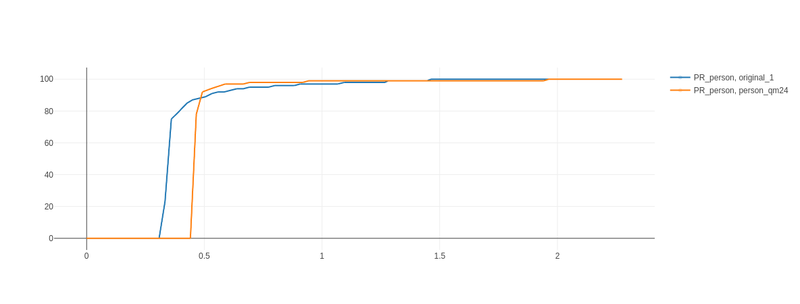

# Quantization

## Define 
Quantization is a mathematical technique that converts a continuous variable to a discrete one. This variable is called a quantized variable. This process is known as quantization and is widely utilized in digital signal processing, machine learning (especially deep learning), and data compression. 

**What is the purpose of quantization?**\
In general, to accelerate computations, these are the benefits of the quantization process.
- Reduce memory/storage (e.g., float32 → int8).
- Accelerate computations (integer ops are faster).
- Enable edge-device deployment (mobile, IoT).

There are several types of quantization that can be applied in deep learning. 1  Here are the following:

- **Weight Quantization:** Model weights are converted from float to lower-bit integers.
- **Activation Quantization:** Intermediate outputs (activations) are quantized.
- **Post-Training Quantization (PTQ):** Applied after model training.
- **Quantization-Aware Training (QAT):** Simulates quantization during training for better accuracy.

Weight quantization involves decreasing the precision of a model's weights by converting them to lower-bit integers, such as 8-bit values. Similarly, activation quantization reduces the precision of
the intermediate activations produced during inference. Post-training quantization (PTQ) refers to quantizing both weights and activations after the model has been trained, without the need for retraining. In contrast, quantization-aware training (QAT) incorporates quantization into the training process itself, allowing the model to adapt to quantized representations as it learns. 


*Note: QAT is generally more time-consuming than PTQ and typically leads to higher accuracy compared to PTQ, especially at lower bitwidths (e.g., INT4 or INT8).*


| Technique | Time                                      | Accuracy                                                   |
| :-------- | :---------------------------------------- | :--------------------------------------------------------- |
| QAT       | More time-consuming (requires fine-tuning) | Generally higher accuracy, especially at low bitwidths      |
| PTQ       | Faster (post-training, minimal calibration) | Potentially lower accuracy compared to QAT                 |


## Mathematics Representation

**What is the mathematical formual for quantization?**\
Quantization fundamentally involves mapping a continuous variable (e.g., a continuous signal) to a discrete set of values.

### Formula:

$Q(x) = \text{round}\left(\frac{x}{\Delta}\right)+ Z$


- x: Original floating-point value.
- $\Delta$: Scale factor (step size between quantized levels).
- $Z$: Zero-point (integer bias to represent zero in quantized space).

**Example: Floating-Point to 8-bit Integer Quantization**

Suppose we have:
A floating-point range: $[-2.0, 2.0]$

We want to quantize to 8-bit integers (range: $[-128, 127]$).

**Step 1: Calculate Scale ($\Delta$) and Zero-Point ($Z$)**

Scale factor (step size), calculated as:

$\Delta = \frac{\text{max}_{\text{float}} - \text{min}_{\text{float}}}{\text{max}_{\text{int}} - \text{min}_{\text{int}}}$

$\Delta = \frac{\text{max}_{\{\text{float}\}} - \text{min}_{\{\text{float}\}}}{\text{max}_{\{\text{int}\}} - \text{min}_{\{\text{int}\}}} = \frac{\text{Input Range}}{\text{Quantized Range}}$

$\Delta = \frac{\text{Input Range}}{\text{Quantized Range}} = \frac{2.0 - (-2.0)}{127 - (-128)} = \frac{4.0}{255} \approx 0.0157$

The zero-point is calculated as:

$Z = \text{round}\left( \frac{0 - \text{min}_{\text{float}}}{\Delta} \right) - \text{min}_{\text{int}}$

Where:\
$\text{min}_{\text{float}}$: Minimum value in the original floating-point range.\
$\text{min}_{\text{int}}$: Minimum value in the target integer range (e.g., $-128$ for 8-bit signed integers).

$Z = \text{round}\left( \frac{0 - (-2.0)}{\Delta} \right) - 128 = \text{round}\left( \frac{2.0}{0.0157} \right) - 128 \approx \text{round}(127.3885) - 128 \approx 127 - 128 = -1$

(This shifts the quantized value to center around zero.)


**Step 2: Quantize a Sample Value**

Let's quantize $x = 1.3$:

**Scale & Round:**
$\text{Quantized Int} = \text{round}\left(\frac{1.3}{\Delta}\right) + Z = \text{round}\left(\frac{1.3}{0.0157}\right) - 1 \approx 83 - 1 = 82$

Store as 8-bit integer: $82$ (instead of the float $1.3$).

**Step 3: Dequantize Back to Float**

To recover the approximate original value:

$x_{\text{dequent}} = (q_{\text{variable}} - Z) \times \Delta  $

$x_{\text{dequant}} =  (82 - (-1)) \times 0.0157 \approx 83 \times 0.0157 \approx 1.3031$

(Close to the original $1.3$, with minor precision loss.)


## Practical Use Case (Deep Learning)
In neural networks, weights and activations are quantized using this method to reduce model size (e.g., 32-bit floats → 8-bit integers) while preserving accuracy.

Both [TensorFlow](https://www.tensorflow.org/model_optimization/guide/quantization/training_example) and [PyTorch](https://pytorch.org/docs/stable/quantization.html) provide good code examples for quantizing models after they've been trained (post-training quantization) and during training (quantization-aware training). I've worked on quantizing models using TensorFlow before. Currently, I'm trying to use quantization-aware training to quantize a YOLOv5 model that is designed to detect only one class: people. This project has been quite difficult because we need to change all the layers from a class-based structure to a functional one. Additionally, we have to break down the block layers, which are groups of multiple layers combined into a single block, into their individual components for the quantization process. I have some code for quantization-aware training, but unfortunately, I can't share all of it due to a non-disclosure agreement.


Here is a Python code snippet for quantizing YOLOv5.

```python
import tensorflow_model_optimization as tfmot
...

## load Fuctional Model
func_model,  anchor, grid, stride = craete_funtional_model(keras_model, batch_size=batch_size)
func_model.summary()
func_model.load_weights("weights/checkpoint/last")
func_model.trainable = True
for layer in func_model.layers:  
layer.trainable = True

# Quantization Model 
qm = tfmot.quantization.keras.quantize_model(func_model)
qm.summary()
...

for epoch in range(start_epoch, epochs+1):
mloss = tf.zeros(3)  # mean losses

start_time = time.time() 
for step, (imgs, targets, paths, shapes) in enumerate(train_loader): 
    step_time = time.time()
    imgs_tf = torch_to_tf(imgs)

    with tf.GradientTape(watch_accessed_variables=False, persistent=False) as tape:
        
        tape.watch(qm.trainable_variables)
        p = qm(imgs_tf, training=True)
        preds = convert_prediction(p)
        total_loss, loss_items = compute_loss(targets, preds)

    grads = tape.gradient(total_loss, qm.trainable_variables)
    ## preprocess before assigned grads 
    optimizer.apply_gradients(
        zip(grads, qm.trainable_variables),
        experimental_aggregate_gradients=False,
        )

    lr =lr_fn(step)
    optimizer.lr.assign(lr)
    mloss = (mloss * step + loss_items) / (step + 1)  # update mean losses
    mloss_ = mloss.numpy()										
    print(
        "=> Epoch {}, Step {}, Total Loss {:.5f}, -- lbox {:.4f}  lobj {:.4f}  lcls {:.4f} -- LR {:.5f} duration {:.3f} s".format(
                epoch,
                step,
                float(total_loss),
                float(mloss[0]),
                float(mloss[1]),
                float(mloss[2]),
                float(lr),
                time.time() - step_time,
            )
        )

if total_loss < 1.15 or epoch % 5:
    save_model(qm, "./weights/quant/best_saved_model")
    qm.save_weights(f"./weights/quant/checkpoint/q_{str(epoch)}")
```


The diagram below compares the precision of the original model (FP32) with the precision of the model that has undergone quantization-aware training.





In this diagram, the orange line represents the quantized model (int8), and the blue line represents the original model (FP32). As you can see, after a certain point, the precision of the quantized model becomes very close to, and even the same as, the original model's precision. This demonstrates that quantization-aware training (QAT) is effective in keeping the model's accuracy high while reducing memory usage and speeding up the time it takes to make predictions (inference time). Models trained this way are particularly well-suited for devices with limited resources, such as the Nvidia Jetson, or for running on CPUs like those from Qualcomm. 


## Find more 

https://medium.com/@joel_34050/quantization-in-deep-learning-478417eab72b
https://huggingface.co/docs/optimum/en/concept_guides/quantization#references\
https://www.geeksforgeeks.org/quantization-in-deep-learning/


